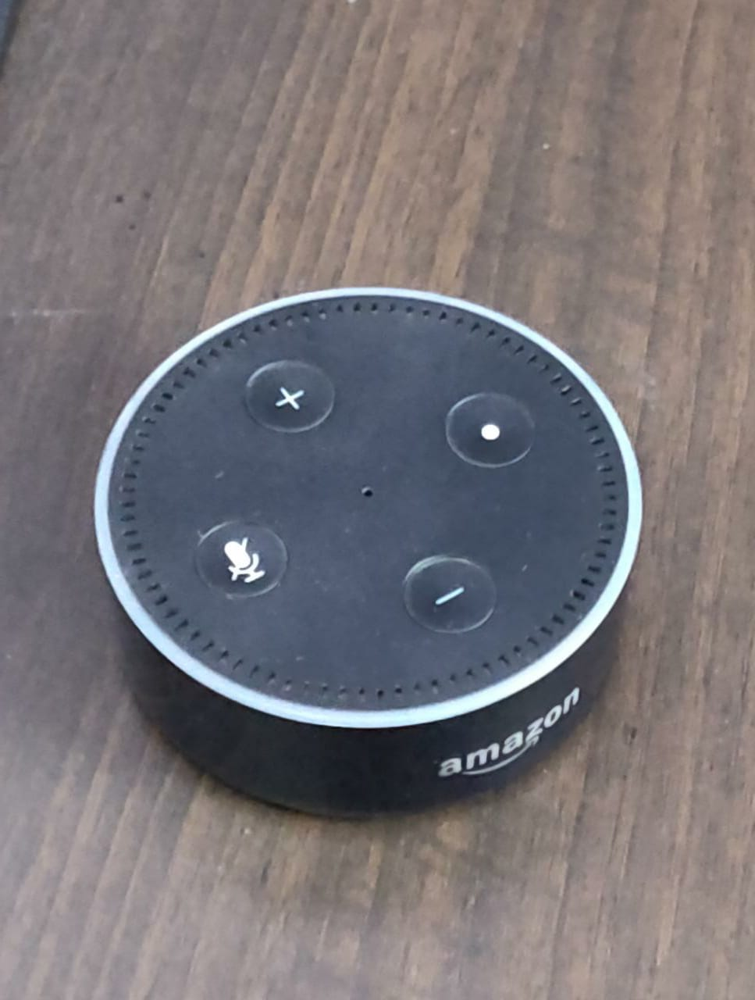
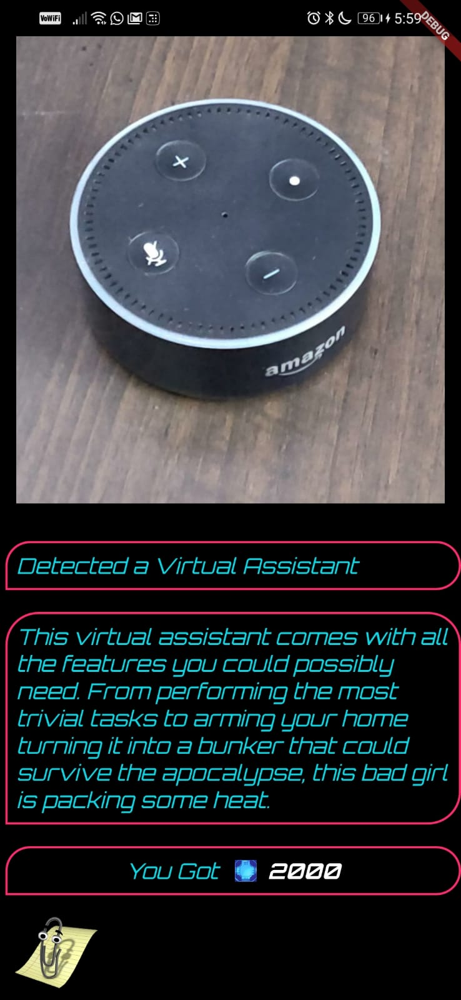
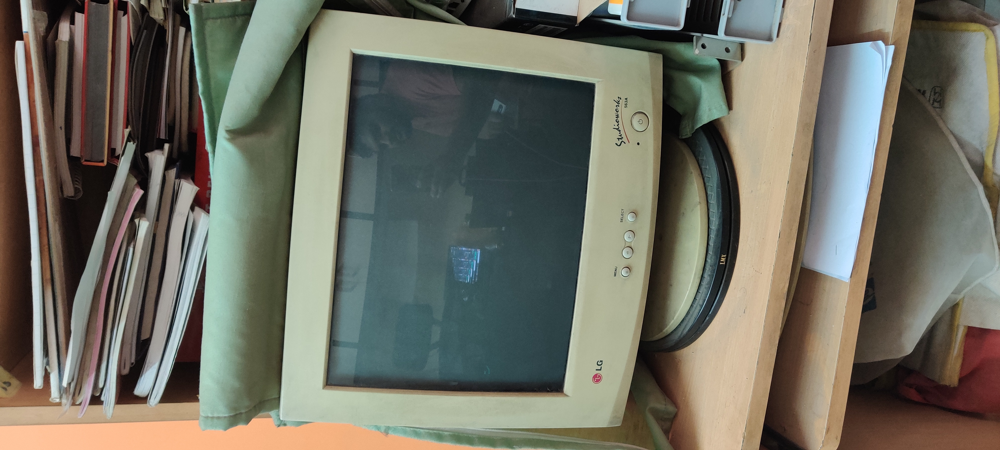
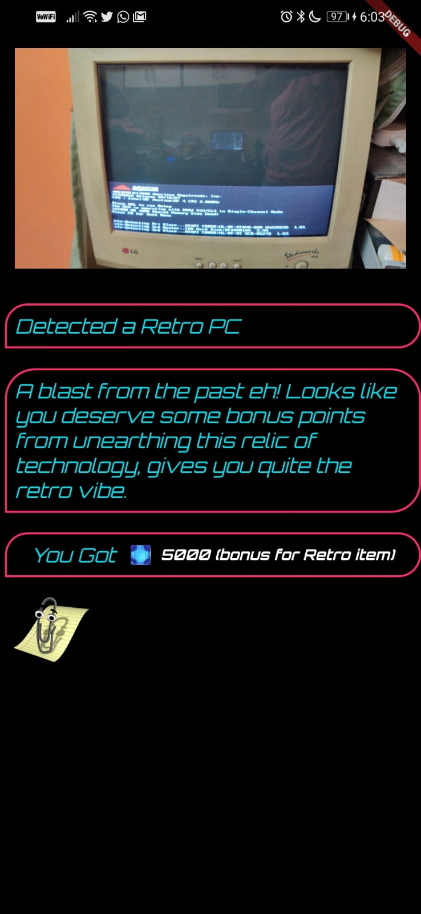

# CODIV_2078

A new Flutter application.

  

    
    
Animated Demo of the App

  

## Screenshots
_                          |       _
:-------------------------:|:-------------------------:
  |  
  |  
## Lore

### Virtual Assistant [ Freya ]
This virtual assistant comes with all the features you could possibly need.
From performing the most trivial tasks to arming your home turning it into a bunker that could survive the apocalypse, this bad girl is packing some heat.
 
### Scrap
Well, that’s a bummer, looks like you have picked up some worthless piece of scrap, better to toss it away rather than lugging it around with you.
 
### Retro
A blast from the past eh! Looks like you deserve some bonus points from unearthing this relic of technology, gives you quite the retro vibe.
 
### Holocube
Holocube uses state-of-the-art technology. Now you can carry your workstation everywhere using this tiny powerhouse combining extreme computing capabilities and a holographic system.
